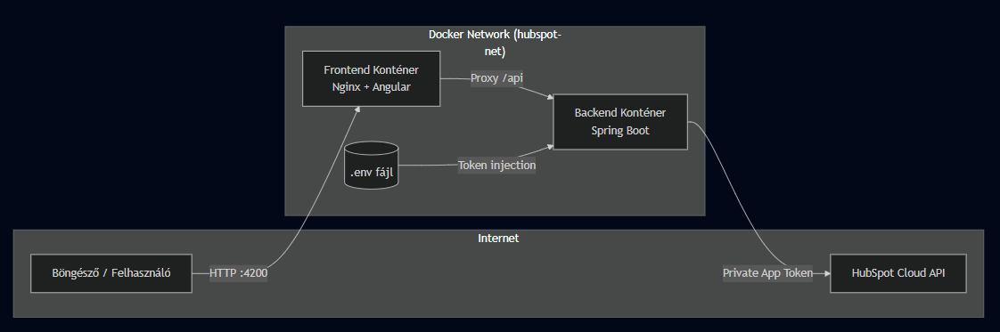
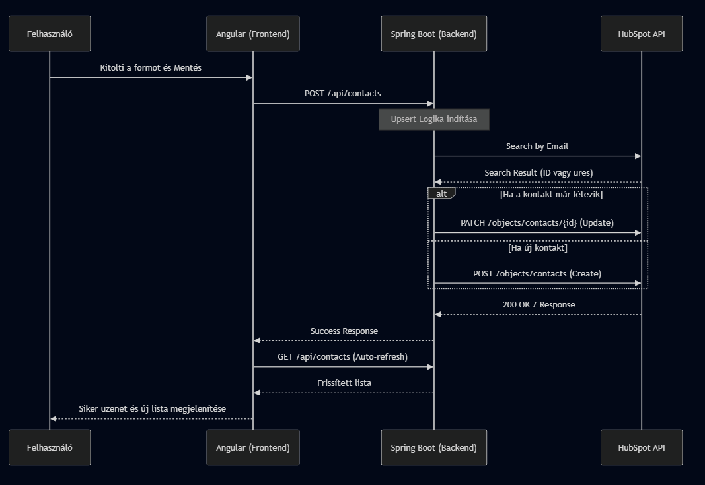
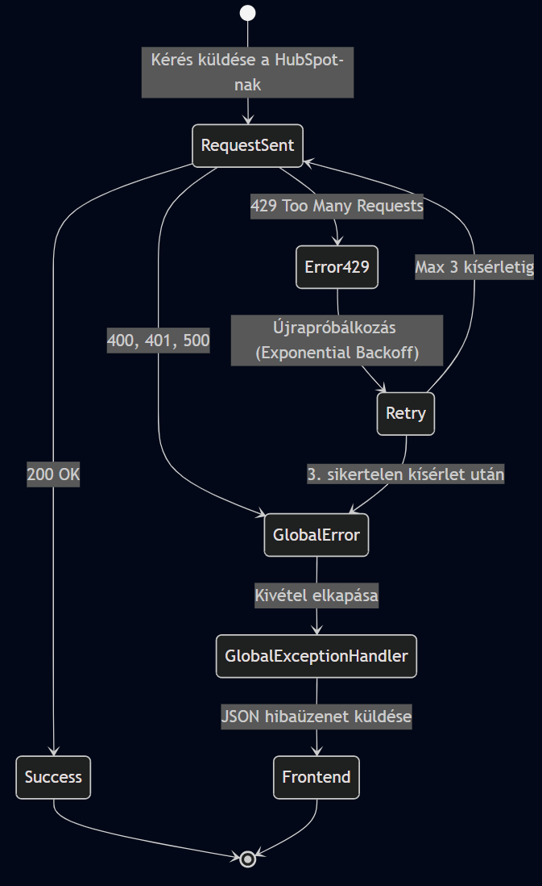

# HubSpot Contact Manager - Próbafeladat

Ez a projekt egy konténerizált Full-Stack alkalmazás, amely a HubSpot CRM rendszerével kommunikálva teszi lehetővé a kapcsolatok (contacts) listázását és szinkronizálását (Upsert logika).

## Rendszerarchitektúra

Az alkalmazás három fő rétegből áll, amelyek Docker hálózaton keresztül kommunikálnak:
1. Frontend: Angular 17+ (Standalone), Nginx kiszolgálóval.
2. Backend: Spring Boot 3.x (Java 21).
3. Külső API: HubSpot CRM API.



---

## Telepítés és Futtatás

A futtatáshoz mindössze Docker és Docker Compose szükséges.

1. Környezeti változók: Hozz létre egy .env fájlt a gyökérkönyvtárban az alábbi tartalommal:
   ```
   HUBSPOT_PRIVATE_APP_TOKEN=<private app token>
   ```

2. Indítás: Az alábbi parancsot a terminálban a projekt root mappájában futtatva:
    ```
   docker compose up --build
   ```

3. Elérés(+Portok) és endpointok: 
   - Felhasználói felület: http://localhost:4200
   - API végpontok: 
        - http://localhost:8080/api/contacts 
            - GET: A frontend ezzel kéri le a HubSpotból szinkronizált kapcsolatok listáját az oldal betöltésekor vagy frissítéskor.
            - POST	Az Angular form elküldésekor hívódik meg. Ez indítja el az "Upsert" folyamatot (keresés, majd mentés vagy frissítés).
        - http://localhost:8080/api/contacts/test-error/{code} : Teszt végpont: Ezzel lehet szimulálni a különböző hibaállapotokat (400, 401, 429 stb.) a globális hibakezelő teszteléséhez.

    - HubSpot végpontok:
        - **/crm/v3/objects/contacts/search** : Az Upsert logika első lépése. Itt keresünk rá a megadott email címre, hogy megtudjuk, létezik-e már a felhasználó.
        - **/crm/v3/objects/contacts** : Akkor használjuk, ha a keresés nem talált eredményt. Ezzel hozzuk létre az új kontaktot.
        - **/crm/v3/objects/contacts/{id}** : Akkor használjuk, ha a keresés talált egy létező azonosítót (ID). Ezzel frissítjük a meglévő kontakt adatait. (PATCH)
        - **/crm/v3/objects/contacts?properties=...** : A teljes lista lekérésére szolgál. Itt adjuk meg paraméterben, hogy az email, firstname és lastname mezőket is adja vissza a HubSpot.

---

## Megoldások

### 1. Upsert 
A backend nem csupán adatokat küld, hanem keresés-alapú mentést végez. Először ellenőrzi az email cím létezését a HubSpotban:
- Ha a kontakt létezik, a rendszer frissíti a meglévő rekordot.
- Ha nem létezik, új rekordot hoz létre.



### 2. Hibatűrés és Retry Logic (429 handling)
A HubSpot API korlátozásainak kezelésére a backend Exponential Backoff stratégiát alkalmaz. Amennyiben 429 Too Many Requests hiba érkezik, a rendszer automatikusan megismétli a kérést növekvő várakozási idővel.

### 3. Globális Hibakezelés (Exception Mapping)
A @RestControllerAdvice használatával a backend minden kritikus hibát (400, 401, 403, 429, 500) egységes JSON üzenetté formál, így a frontend felhasználóbarát hibaüzeneteket jeleníthet meg.



### 4. Modern Angular Frontend (Standalone)

- Mivel nem volt tapasztalatom angularral, kihívásként ezzel szerettem volna megoldani. Egyik legnagyobb "utánajárós" :D része pedig a proxy és a CORS problémák megoldása okozta.
@CrossOrigin(origins = "*") ment a backend controllerre.
Nem tartom túl biztonságosnak viszont, ha konkrétan a frontend-et adtam meg nem tudta feloldani a problémát.

- Nginx Reverse Proxy: Docker környezetben az Nginx irányítja az /api kéréseket a backend konténerhez, elkerülve a CORS problémákat.

---

## Tesztelés

### Automatikus tesztek
A backend integrációs tesztekkel ellenőrzi a hibakezelőt

### Manuális hibatesztelés
A bírálók számára elérhetővé tettem egy teszt-végpontot a hibakezelés demonstrálására:
- GET /api/contacts/test-error/401 -> 401 Unauthorized szimulálása.
- GET /api/contacts/test-error/429 -> 429 Rate Limit szimulálása.